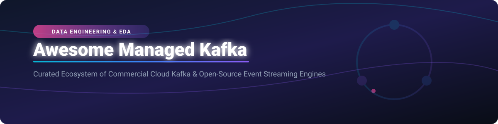

  

# 🚀 Awesome Managed Apache Kafka Service Ecosystem 📡

  
  
  
  
  
  

> **Curated List of SaaS Products, Commercial Cloud Streaming Services & Open-Source GitHub Projects**  
> *Focused on Managed Kafka, Event-Driven Architecture, Real-Time Analytics & Self-Hosted Data Backbones*  
> **Last updated: October 2026** 📅

---

This repository tracks notable **commercial managed Kafka platforms** and **open-source projects** that provision, operate, and scale Apache Kafka clusters — powering event-driven architectures, real-time analytics, and data pipelines without the operational burden of self-managing brokers, Zookeeper / KRaft, and storage.

---

## 📋 Table of Contents

- [☁️ SaaS & Commercial Managed Platforms](#-saas--commercial-managed-platforms)
- [⚡ Market Overview & Sector Analysis](#-market-overview--sector-analysis)
- [🔓 Open-Source GitHub Projects](#-open-source-github-projects)
  - [📦 Kafka Core & Streaming Engines](#-kafka-core--streaming-engines)
  - [☸️ Kubernetes Operators](#-kubernetes-operators)
  - [🔄 Stream Processing Frameworks](#-stream-processing-frameworks)
  - [🔀 Data Movement, Connectors & CDC](#-data-movement-connectors--cdc)
  - [🖥️ Kafka UI & Management Operations](#-kafka-ui--management-operations)
  - [🛠️ Additional Open-Source Ecosystem Options](#-additional-open-source-ecosystem-options)
- [📈 Star History](#-star-history)
- [🤝 How to Contribute](#-how-to-contribute)
- [💖 Support & Sponsorship](#-support--sponsorship)
- [⚠️ Disclaimer & Operational Notes](#️-disclaimer--operational-notes)

---

## ⚡ Market Overview & Sector Analysis

The global managed event streaming and Apache Kafka market size is estimated at **~$3.2 Billion in 2026**, growing at a CAGR of **~22%** driven by enterprise migration to real-time event-driven architectures and streaming analytics. The sector exhibits **moderate fragmentation with high concentration at the top**: hyper-scalers (Amazon MSK, Azure Event Hubs) and specialized event-streaming pioneer Confluent Cloud capture over **65% of enterprise market share**, while high-performance challengers (Redpanda Cloud) and niche multi-cloud/serverless providers (Aiven, Upstash) capture specialized serverless and low-latency segments.

---

## ☁️ SaaS & Commercial Managed Platforms

Below is a comparison of top commercial managed Apache Kafka services, sorted by company size (valuation / enterprise revenue descending).

| Platform 🚀 | Starting Tier Pricing 💰 | Free Tier / Trial Limit 🆓 | Market Valuation / Revenue 🏢 | Best For 🎯 |
| :--- | :--- | :--- | :--- | :--- |
| **[Azure Event Hubs](https://azure.microsoft.com/en-us/products/event-hubs/)** | $0.015/hour (~$11/mo Basic) | $200 free credit (30-day Azure trial) | **~$3.1 Trillion** (Microsoft Valuation) | Azure-native streaming & big data integration |
| **[Amazon MSK](https://aws.amazon.com/msk/)** | $0.042/hour per broker (~$30/mo) | AWS Free Tier: 750 hrs/mo MSK Serverless t3.small | **~$2.0 Trillion** (Amazon Valuation) | AWS-native serverless & cluster Kafka workloads |
| **[IBM Event Streams](https://www.ibm.com/products/event-streams)** | $0.56/hour (~$400/mo Enterprise) | IBM Cloud $200 credit + 30-day trial | **~$200 Billion** (IBM Valuation) | IBM Cloud enterprise & Hybrid Cloud workloads |
| **[Confluent Cloud](https://www.confluent.io/confluent-cloud/)** | $0.00/hr base ($0.10/GB throughput) | $400 free credit valid for 30 days | **~$9.5 Billion** (Public Market Cap / Valuation) | Enterprise standard event streaming & Flink SQL |
| **[Aiven for Apache Kafka](https://aiven.io/kafka)** | $0.26/hour (~$187/mo startup tier) | $300 free credit for 30 days | **~$3.0 Billion** (Private Valuation) | Multi-cloud managed Kafka (AWS, GCP, Azure, DO) |
| **[Instaclustr Kafka](https://www.instaclustr.com/)** | $0.14/hour per node (~$100/mo) | 30-day free trial (Small cluster node) | **~$500 Million** (Acquired by NetApp) | Open-source multi-service data stack management |
| **[Redpanda Cloud](https://redpanda.com/)** | $0.20/hour (~$144/mo Serverless) | $300 free cloud credit for 14 days | **~$400 Million** (Private Series C Valuation) | Ultra-high performance C++ Kafka compatibility |
| **[Lenses.io](https://lenses.io/)** | $350/month (Developer Edition) | 30-day free Developer License trial | **~$100 Million** (Acquired by Celonis) | Kafka governance, SQL queries & developer portal |
| **[Upstash Kafka](https://upstash.com/kafka)** | $0.20 per 100k requests ($0.60/GB) | Free Tier: 10k msgs/day (Max 256MB storage) | **~$50 Million** (Private VC Backed) | Serverless per-request pricing & edge messaging |
| **[CloudKarafka](https://www.cloudkarafka.com/)** | $5.00/month (Developer Duck tier) | Free Tier: Developer Plan (5 topics, 10MB storage) | **~$10 Million** (Private Bootstrapped/84codes) | Small to medium lightweight Kafka cluster hosting |

---

## 🔓 Open-Source GitHub Projects

### 📦 Kafka Core & Streaming Engines

- **[Apache Kafka](https://github.com/apache/kafka)**   
  *The de facto standard distributed event streaming platform.* Apache-2.0 licensed. Distributed, fault-tolerant, high-throughput pub/sub messaging engine powering modern real-time architectures.
- **[Apache Pulsar](https://github.com/apache/pulsar)**   
  *Multi-tenant, high-performance messaging and streaming engine.* Apache-2.0 licensed. Features native geo-replication, tiered storage, and unified pub/sub.
- **[NATS Server](https://github.com/nats-io/nats-server)**   
  *Cloud-native connective technology for pub/sub & JetStream persistence.* Apache-2.0 licensed. Lightweight, ultra-fast streaming engine for microservices and IoT.
- **[Redpanda](https://github.com/redpanda-data/redpanda)**   
  *Kafka-compatible event streaming platform written in C++.* BSL licensed. JVM-free, Zookeeper-free engine delivering up to 10x lower tail latencies.

---

### ☸️ Kubernetes Operators

- **[Strimzi Kafka Operator](https://github.com/strimzi/strimzi-kafka-operator)**   
  *Kubernetes-native operator for running Apache Kafka.* Apache-2.0 licensed. Simplifies Kafka deployment, Connect configuration, MirrorMaker, and Cruise Control on K8s.
- **[Koperator](https://github.com/banzaicloud/koperator)**   
  *Flexible Kubernetes operator for Kafka clusters by Banzaicloud.* Apache-2.0 licensed. Focuses on automated cluster provisioning, Cruise Control integration, and fine-grained broker setup.
- **[Confluent Operator](https://github.com/confluentinc/operator)**   
  *Commercial & cloud-native Kubernetes operator for Confluent Platform components.*

---

### 🔄 Stream Processing Frameworks

- **[Apache Spark](https://github.com/apache/spark)**   
  *Unified engine for large-scale data analytics & Structured Streaming.* Apache-2.0 licensed. Micro-batch streaming with exactly-once guarantees.
- **[Apache Flink](https://github.com/apache/flink)**   
  *Stateful stream processing standard for real-time data pipelines.* Apache-2.0 licensed. Low-latency, event-time processing with savepoints and state management.
- **[Apache Beam](https://github.com/apache/beam)**   
  *Unified programming model for batch and streaming pipelines.* Apache-2.0 licensed. Portable execution across Flink, Spark, and Google Cloud Dataflow.
- **[ksqlDB](https://github.com/confluentinc/ksql)**   
  *Event streaming database purpose-built for Apache Kafka.* Confluent Community License. SQL interface for defining stream processing queries and materialized views.
- **[Kafka Streams](https://github.com/apache/kafka)**   
  *Client library for building stream applications on Kafka.* Apache-2.0 licensed. Runs embedded inside Java applications without separate cluster dependencies.

---

### 🔀 Data Movement, Connectors & CDC

- **[Vector](https://github.com/vectordotdev/vector)**   
  *High-performance observability data pipeline.* MPL-2.0 licensed. Collects, transforms, and routes log and event data to Kafka and cloud sinks.
- **[Debezium](https://github.com/debezium/debezium)**   
  *Distributed Change Data Capture (CDC) platform.* Apache-2.0 licensed. Captures database row changes (MySQL, Postgres, Oracle, MongoDB) into Kafka topics.
- **[Benthos / Redpanda Connect](https://github.com/redpanda-data/connect)**   
  *Declarative stream processing buffer and ETL pipeline engine.* Apache-2.0 licensed. Code-free YAML pipeline config for stream transformation.
- **[Kafka Connect](https://github.com/apache/kafka)**   
  *Scalable tool for streaming data between Apache Kafka and other systems.* Apache-2.0 licensed. Standard framework for hundreds of open-source source/sink connectors.

---

### 🖥️ Kafka UI & Management Operations

- **[Kafka UI](https://github.com/provectus/kafka-ui)**   
  *Open-source web UI for Apache Kafka clusters.* Apache-2.0 licensed. Multi-cluster administration, topic browsing, consumer group tracking, and connector metrics.
- **[AKHQ](https://github.com/tchiotludo/akhq)**   
  *Kafka GUI for searching data, managing topics, consumer groups, and schema registry.* Apache-2.0 licensed.
- **[Kafdrop](https://github.com/obsidiandynamics/kafdrop)**   
  *Lightweight web UI for viewing Kafka topics and monitoring consumer lags.* Apache-2.0 licensed.
- **[Cruise Control](https://github.com/linkedin/cruise-control)**   
  *Automated cluster rebalancing and self-healing engine by LinkedIn.* BSD-2-Clause licensed.
- **[Karafka](https://github.com/karafka/karafka)**   
  *Multi-threaded Ruby framework for event-driven applications on Apache Kafka.* LGPL-3.0 licensed.

---

### 🛠️ Additional Open-Source Ecosystem Options

- **[Fluent Bit](https://github.com/fluent/fluent-bit)**  — Fast lightweight log/metric processor for Linux & K8s forwarding to Kafka.
- **[Fluentd](https://github.com/fluent/fluentd)**  — Unified data collector for log routing and ingestion into Kafka.
- **[Apache NiFi](https://github.com/apache/nifi)**  — Visual data flow automation and routing platform with native Kafka processors.
- **[Logstash](https://github.com/elastic/logstash)**  — Server-side data processing pipeline ingesting and sending Kafka streams.
- **[Apache SeaTunnel](https://github.com/apache/seatunnel)**  — High-performance distributed data integration engine supporting real-time Kafka sync.
- **[Apache Samza](https://github.com/apache/samza)**  — Stateful stream processing framework integrated with Apache Kafka.
- **[Embulk](https://github.com/embulk/embulk)**  — Open-source bulk data loader supporting Kafka input/output plugins.
- **[Apache Storm](https://github.com/apache/storm)**  — Distributed real-time computation system for streaming data.

---

## 📈 Star History

---

## 🤝 How to Contribute

1. Fork this repository.
2. Add or update entries in `README.md` maintaining table/markdown list formatting.
3. Ensure pricing, free tier limits, and GitHub link details remain factual and clear.
4. Open a Pull Request with a brief explanation of your suggested addition!

Check out [Awesome-Awesome-Awesome](https://github.com/ishandutta2007/Awesome-Awesome-Awesome) for more curated lists!

---

## 💖 Support & Sponsorship

If you find this curated list helpful for evaluating managed Kafka options or designing your data architecture, please consider:
- 🌟 **Starring** this repository to increase visibility.
- 🔀 **Sharing** it with team members, data engineers, and cloud architects.
- ☕ **Sponsoring** the maintainer via [GitHub Sponsors](https://github.sponsors/ishandutta2007).

---

## ⚠️ Disclaimer & Operational Notes

- This list is **community-curated** for architectural research and comparison — not an official endorsement.
- **Licensing Considerations**: Verify project licenses before production adoption (e.g., Redpanda uses BSL, ksqlDB uses Confluent Community License, Apache Kafka/Strimzi use Apache-2.0).
- **Zookeeper Deprecation**: Apache Kafka has fully transitioned to **KRaft mode** (KIP-833). Avoid deploying Zookeeper for new clusters.
